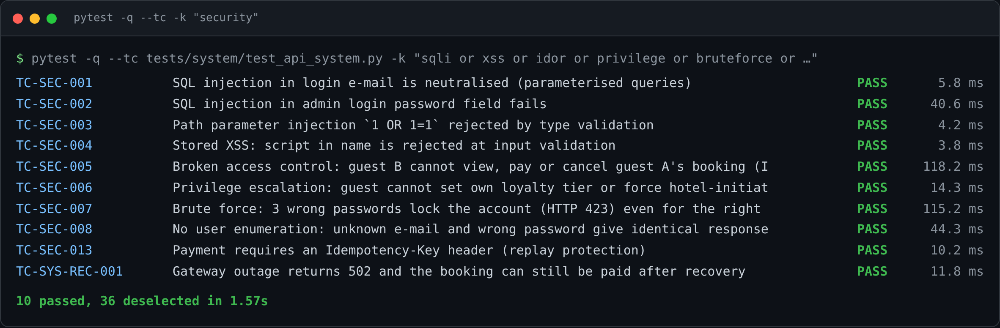
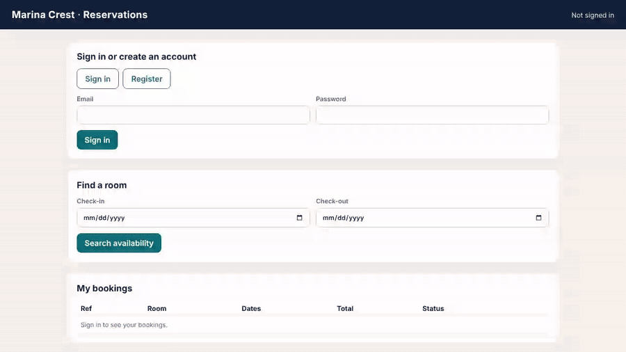
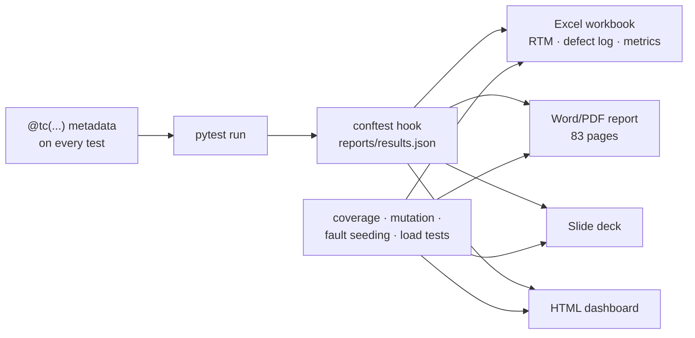

<div align="center">

# Hotel Room Reservation System — Verification & Validation

**A working hotel booking system, and a complete, measured test campaign built around it.**

[](https://github.com/RaktimChandra/hotel-reservation-vv/actions/workflows/ci.yml)
[](https://github.com/RaktimChandra/hotel-reservation-vv/actions/workflows/quality.yml)
[](https://github.com/RaktimChandra/hotel-reservation-vv/releases/latest)




</div>

---

## Why this repository exists

Most test suites answer *"do the tests pass?"*. This project also answers *"are the tests any good?"* and *"would anyone else get the same result?"*

I specified and built **HRRS** (FastAPI · SQLite · vanilla JS), then verified and validated it with **554 executable test cases**. Every case carries IEEE 829 metadata on the test itself, and every result in the report, workbook and dashboard is written by the real run — nothing is typed by hand.

| | Result |
|---|---|
| Test cases executed | **554** — 552 passed, 2 skipped (Firefox/WebKit unavailable in the lab), 0 failed |
| Structural coverage | **867 / 867** statements · **255 / 256** branches |
| Mutation score | **267 / (270 − 3 equivalent) = 100 %** with a purpose-built AST mutation engine |
| Fault seeding | **12 / 12** seeded faults detected (Mills estimate of latent defects ≈ 0) |
| Performance | p95 **149.6 ms** at 25 concurrent users (SLA 300 ms), 0 % errors |
| Accessibility | axe-core WCAG 2.1 A/AA: **0** serious/critical violations |
| Defects found | **10**, all fixed and regression-protected — 5 product/test-suite, 5 packaging/documentation |

## What it demonstrates

**Black-box test design** — boundary value analysis (174 cases), equivalence partitioning (93), decision tables (44), cause-effect graphing (14), state transition (38, all 30 cells of the state table), pairwise with an independent oracle, property-based testing with Hypothesis, error guessing.

**White-box test design** — control-flow graphs and cyclomatic complexity, basis paths, statement → branch → condition → **MC/DC**, data-flow (all-defs / all-uses) and loop testing; coverage-guided tests to close measured gaps.

**Every test level** — unit (448) → integration (31, incl. a 20-thread overbooking race repeated 25×) → system/API (56) → end-to-end UI in a real browser (15) → acceptance in Gherkin (UAT).

**Non-functional testing** — load, stress, spike, soak and volume campaigns; OWASP-style security tests (SQL injection, XSS, IDOR, privilege escalation, brute-force lock-out, user enumeration, idempotent payments); recovery via gateway fault injection; accessibility; responsive layouts on emulated devices.

**Testing the tests** — mutation testing drove the score from 85.9 % to 100 % across three iterations; fault seeding exposed a security test that could never fail (DEF-005), which was then fixed.

**Honest reporting** — skipped is reported as skipped, manual cases that need real people are marked *not run* rather than simulated, and the project's own README was tested on a clean machine (it failed, five defects were fixed, and `tools/check_package.py` now guards against them).

<p align="center"></p>

## Quick start

```bash
git clone https://github.com/RaktimChandra/hotel-reservation-vv.git
cd hotel-reservation-vv
python -m venv venv && source venv/bin/activate      # Windows: venv\Scripts\activate
pip install -r requirements.txt
python -m playwright install chromium

pytest -q                                             # 554 cases, ~40 s
uvicorn app.main:app --reload --port 8765             # app on http://127.0.0.1:8765  (admin@hrrs.test / Admin@123 — demo only)
```

### Watch the tests run

```bash
pytest -q --tc -m security                 # one line per test case: ID · objective · PASS/FAIL · time
python tools/live_demo.py                  # guided 11-stage demo; the E2E stage drives a visible browser
```

A full presenter's guide (including Windows notes and a "plant a bug and watch it get caught" step) is in **[docs/DEMO.md](docs/DEMO.md)**.

## How the evidence pipeline works



A partial run (`-m smoke`, `-k …`) writes `results_partial.json`, so the full-suite evidence is never overwritten.

## Documentation

| Document | What it covers |
|---|---|
| [Test strategy](docs/TEST_STRATEGY.md) | Levels, entry/exit criteria, risk register, where each technique lives |
| [Traceability matrix](docs/TRACEABILITY.md) | Every requirement → executed test cases per level, generated from the run |
| [Live demo guide](docs/DEMO.md) | Step-by-step script for demonstrating the app and running tests live |
| [Contributing](CONTRIBUTING.md) | `@tc` metadata, test-case ID scheme, pull-request checklist |
| [Security](SECURITY.md) | Scope and demo-credential notes |
| [Changelog](CHANGELOG.md) | What changed in each release |
| Release assets | 83-page test report, slide deck, Excel workbook, IEEE 829 summary report, manual-test kit, demo video |

## Continuous integration

| Workflow | Runs | What it does |
|---|---|---|
| **CI** | every push / PR | Ruff + Bandit + packaging checks · all 554 cases on Python 3.11 and 3.13 with coverage · E2E in Chromium, Firefox and WebKit |
| **Test quality** | weekly + on demand | Mutation testing with a 90 % score gate · fault seeding |
| **Release** | on `v*` tags | Builds the report, deck, workbook, dashboard, one-pager and video from the committed evidence and attaches them to the release |

## Repository layout

```
app/                 system under test — domain rules, service layer, REST API, web UI
tests/
  unit/              BVA · ECP · decision tables · cause-effect · state transition · white-box ·
                     pairwise · property-based · error guessing · mutation-guided
  integration/       service + SQLite + payment-gateway stub, concurrency race
  system/            API functional, negative, contract, security, recovery, performance, coverage-guided
  e2e/               Playwright browser tests, axe-core accessibility, devices, cross-browser
  acceptance/        Gherkin features executed with pytest-bdd
tools/               perf_test · mutation · fault_seeding · manual_exec · live_demo · check_package ·
                     generators for the workbook, report, deck, dashboard, charts and video
docs/                requirements (FR/NFR) · static-testing & manual-case log · figures · demo guide
reports/             evidence from the last full run (results, coverage, mutation, perf, defects, screenshots)
```

## More commands

```bash
pytest --cov=app --cov-branch --html=reports/test_report.html --self-contained-html
python tools/perf_test.py          # load · stress · spike · soak · volume   → reports/perf.json
python tools/mutation.py           # mutation testing (~5 min)              → reports/mutation.json
python tools/fault_seeding.py      # fault seeding                          → reports/fault_seeding.json
python tools/manual_exec.py        # tool-assisted manual cases (L10N, a11y) → reports/manual/
python tools/check_package.py      # release / packaging checks
ruff check app tests tools         # lint
python tools/make_traceability.py  # regenerate docs/TRACEABILITY.md
```

Shortcuts are in the [Makefile](Makefile): `make test`, `make security`, `make live`, `make coverage`, `make mutation`, `make docs`.

Regenerating the documents needs Node 18+ and LibreOffice:

```bash
npm install
python tools/make_charts.py && python tools/make_diagrams.py && python tools/make_vmodel.py
python tools/make_workbook.py
python tools/doc/toc_pass.py tools/doc/report.js deliverables/HRRS_VV_Test_Report_Raktim.docx
node tools/doc/companions.js && node tools/deck/deck.js && python tools/make_dashboard.py
```

The generated report, deck, workbook, test-summary report, manual-test kit and demo video are attached to the **[latest release](https://github.com/RaktimChandra/hotel-reservation-vv/releases/latest)**.

## Defects found

| ID | Found by | Defect |
|---|---|---|
| DEF-001 | ECP (valid class V4) | Valid name with an initial ("R. Chandra") rejected |
| DEF-002 | Exploratory visual review | Booking-form inputs overflowed their grid cells |
| DEF-003 | Exploratory visual review | Zero discount displayed as "₹-0.00" |
| DEF-004 | Load testing | Booking p95 663 ms under 25 users → 201 ms after WAL tuning |
| DEF-005 | Fault seeding | A DOM-XSS test exercised a path that never reflected input |
| DEF-006…010 | Documentation testing on a clean machine | Unshipped test dependency, unrunnable README line, evidence overwritten by partial runs, mutation output schema, lab-only paths |

Each fix has a regression test (or a packaging check) that was shown to fail on the unfixed code.

## Notes

- Dates in tests run on a frozen clock (8 Oct 2026, 10:00) so every expectation is reproducible.
- Performance figures come from a 2-vCPU machine with one uvicorn worker; absolute numbers will differ elsewhere.
- Built as an individual project for the *Software Verification and Validation* course (FT-3: test-case design and testing levels) at SRM Institute of Science and Technology, 2026–27. Developed with AI pair-programming assistance (Claude); every result is produced by the automated run in this repository.

## Author

**Raktim Chandra** — B.Tech CSE (Software Engineering), SRMIST · [github.com/RaktimChandra](https://github.com/RaktimChandra)

## License

[MIT](LICENSE)
